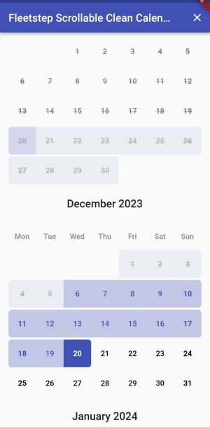
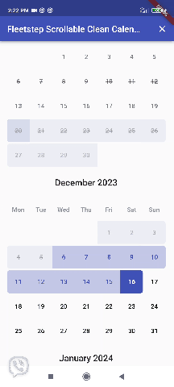

# Fleetstep Scrollable Clean Calendar

A clean calendar widget with vertical scroll, locale and range selection date. This calendar is based on [scrollable clean calendar](https://github.com/FabioFiuza/scrollable_clean_calendar) by
[Fabio Fiuza](https://github.com/FabioFiuza)

There are 2 extensions and both work only for range calendar:
- if the ```initialDateSelected``` is before (or less then) the ```minDate``` the calendar will now actually render the initially set range (with ```initialDateSelected``` and ```endDateSelected```)
- if the ```setEndOnly``` param in callendar controler is set to ```true``` only end date will be set each time user taps on the calendar date and the start date will be always set to ```initialDateSelected```.

These features work only if the rangeMode is true and beauty layout is set.

## Installation

Since this project is built with purpose to support the concrete functionalities needed for specific project, it will not be published to pub.dev
If you for any reason need the same extended functionalities you should include the package in your flutter project like so:

```yaml
dependencies:
  my_flutter_package:
    git:
      url: git@github.com:your_private_path/my_flutter_package.git
      ref: master
```
and then just 
```
flutter pub get
```


## Parameters
Basic parameters are the same as scrollable clean calendar, and these will not be described here,
please refer to  [scrollable clean calendar parameters](https://github.com/FabioFiuza/scrollable_clean_calendar/#parameters). The extended parameters will be described below

### ScrollableCleanCalendar

| Parameter| Type | Default | Description|
| :-------------------------------- | :---------------------------------------------------------------------------------------------------------------------------------------------------------------------------- | :------------------------------------------------------ | :--------------------------------------------------------------------------------------------------------------------------------------------------------------------------------------------------------------------------------------------------------------------- |
|  
| daySelectedDisabledBackgroundColor |Color? | null | A color representing the background of initally selected start date that is in the past and therefore disabled.|
| daySelectedDisabledBackgroundColorBetween | Color? | null| A color representing the background of initally selected range dates that are in the past and therefore disabled.|

### CleanCalendarController

| Parameter| Type| Default| Description|
| :---------------------------- | :-------------------------------------------- | :-------------- | :------------------------------------------------------ |
| setEndOnly| bool | false | If this parameter is selected, each time user taps the calendar the end date in range will be set|


## Layout.DEFAULT

Features are not implemented for the default layout. The fields will not render as expected.

## Layout.BEAUTY

disbled date selected <br>




```dart
ScrollableCleanCalendar(
  calendarController: calendarController,
  layout: Layout.BEAUTY,
  calendarCrossAxisSpacing: 0,
),
```
